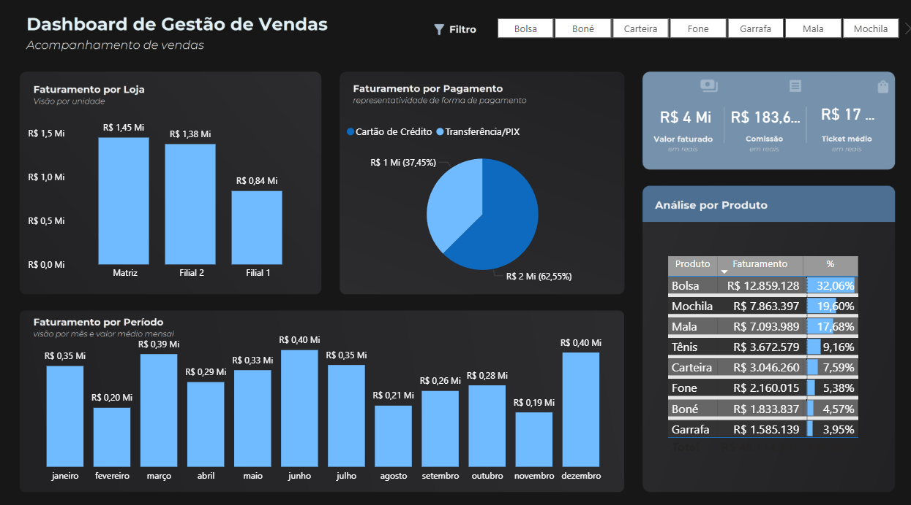

# Dashboard de Gestão de Vendas

Projeto desenvolvido em Power BI para análise de indicadores comerciais e acompanhamento de vendas.

---

##  Dashboard Interativo

Clique abaixo para acessar o relatório no Power BI:

### 🔗 [Abrir Dashboard](https://app.powerbi.com/view?r=eyJrIjoiODU5YzdmY2ItYTg2ZS00ZGI4LWFkZTktMDcxM2JmODY0ZjFhIiwidCI6IjhlYjI5MjAxLWEyN2QtNDMwMi04NDczLWM5ODJlYjViZTkzNSJ9)

---

## Preview do Dashboard

---

## Objetivo do Projeto

Desenvolver um dashboard para acompanhamento de vendas, faturamento e desempenho comercial, permitindo análises por loja, produto, período e forma de pagamento.

---

##  Principais Análises

* Faturamento por loja
* Faturamento por período
* Representatividade por forma de pagamento
* Ranking de produtos
* Ticket médio
* Comissão total

